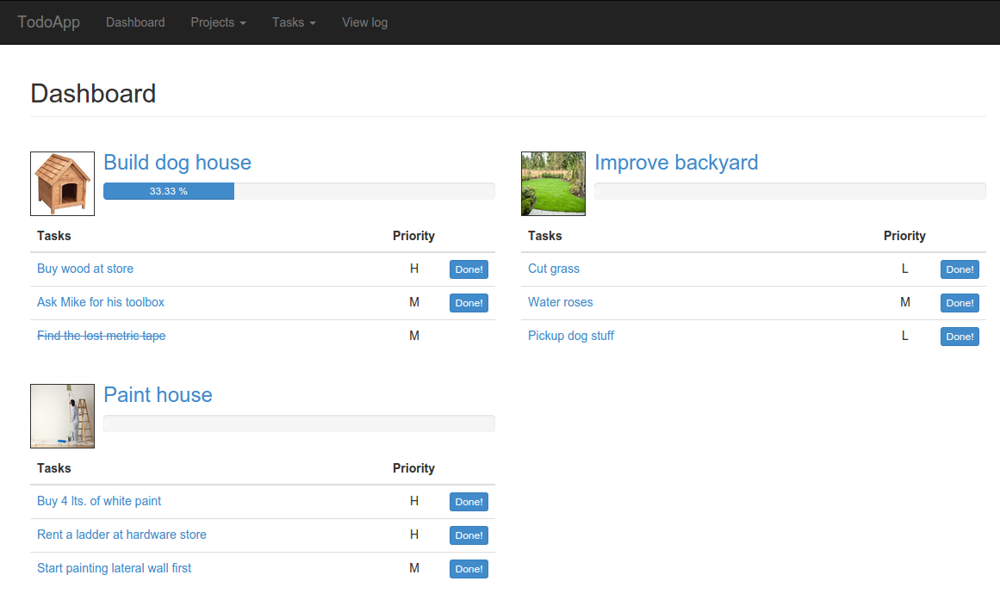
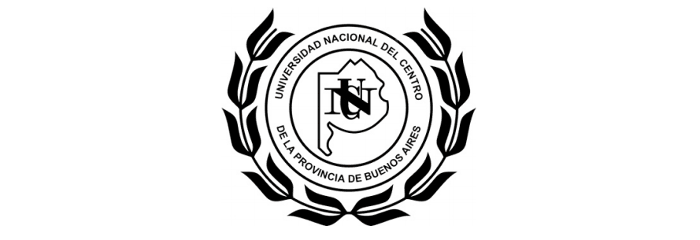

### TodoApp - RestfulObjects for Ruby Demo
This is a simple ToDo application that demostrates the capabilities of the framework [RestfulObjects for Ruby](http://github.com/vizcay/RestfulObjectsRuby).

### How it looks like?


### How to play with it?
If you have a Ruby environment (> 1.9.3) with RubyGems installed, simply run:

```shell
$ git clone https://github.com/vizcay/todo_app_restful_objects
$ cd todo_app_restful_objects
$ bundle install
$ foreman start
```
Then open your browser at 'http://localhost:5000'.

### License
MIT License.

### Credits
This project has been developed as the main subject of Pablo Vizcay undergradute System's Engineering thesis, directed by [Dr. Alejandro Zunino](http://azunino.sites.exa.unicen.edu.ar/) for the [U.N.I.C.E.N. University in Tandil - Buenos Aires - Argentina](http://www.exa.unicen.edu.ar/).


